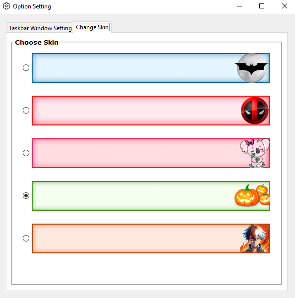
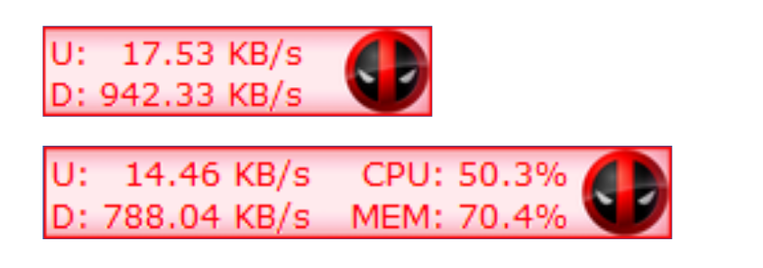
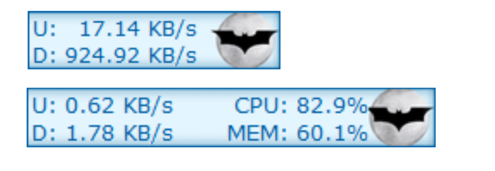
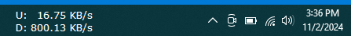
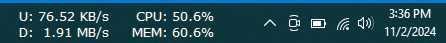

[](https://github.com/Tanzimkshanto/NetMeter-Lite/blob/main/LICENSE)
[](https://github.com/tanzimkshanto/NetMeter-Lite/releases/latest)
[](https://github.com/tanzimkshanto/NetMeter-Lite/releases)

# NetMeter Lite

**NetMeter Lite** is a lightweight, real-time monitoring tool for network speed, CPU, and memory usage, offering a simple and customizable interface for Windows. Perfect for users who want to keep track of their device’s performance without any hassle.

## Features

- **Real-Time Monitoring**: See your network speed, CPU usage, and memory usage in real-time.
- **Customizable Interface**: Tailor the display to match your preferences.
    - 
    - 
- **Lightweight and Efficient**: Designed to be resource-friendly for smooth performance.
- **Skin Customizable**: Choose from 5 preloaded skins. [_Create an issue to request additional skins_]
    - 
    - 
    - 
    - 
    - 
- **Movable Widget**: Place the widget anywhere on your screen for full visibility.
- **Transparent Background**: Check the _Transparent Background_ Box to make it transparent.
    - 
    - 

## Installation
**Please [click here](https://github.com/tanxim/NetMeter-lite/releases/latest) to download the latest version of NetMeter Lite.**

## Install from Source
1. Clone the repository:
    ```bash
    git clone https://github.com/tanxim/netmeter-lite.git
    ```
2. Navigate to the project directory:
    ```bash
    cd netmeter-lite
    ```
3. Install necessary libraries:
    ```bash
    pip install -r requirements.txt
    ```
4. (Optional) To build an executable, run:
    ```bash
    python exe_builder.py
    ```
   - This will create a folder with the `.exe` file in the `dist` folder.

## Usage

- Launch **NetMeter Lite** to monitor network speed, CPU usage, and memory usage in real-time.
- Right-click to open the settings menu, where you can customize display preferences, choose from five available skins, and adjust widget placement.
- Click and hold to move the widget around on the screen.

## Contributing

We welcome contributions! Feel free to submit issues for bug reports or feature requests, or follow the steps below to contribute directly.

1. Fork the repository.
2. Create a new branch:
    ```bash
    git checkout -b feature-branch-name
    ```
3. Make your changes and commit:
    ```bash
    git commit -m "Add new feature or fix a bug"
    ```
4. Push your branch:
    ```bash
    git push origin feature-branch-name
    ```
5. Open a pull request, and we’ll review your changes!

## License

This project is licensed under the [GNU General Public License v3.0](LICENSE). You are free to use, modify, and distribute this software, provided that any modifications are also licensed under GPL-3.0.

## Acknowledgments

Special thanks to all contributors and the open-source community for making projects like this possible.

---

Feel free to report any issues or suggest new features in the Issues tab.  
[Contact me on GitHub](https://github.com/tanxim)
